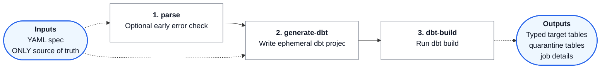

# DataHub Type Materialisation

This repository contains both the Type Materialisation Specification and its
Python reference implementation.

The specification defines a generic YAML format for describing how flat or
schema-on-read data is transformed into typed relational structures such as
views, materialised views, and tables. The reference implementation provides the
`tms` command-line tool for parsing specifications and validating CSV inputs.

The specification is intended to support both:

- CSV-style positional mapping from delimited files.
- Raw or semi-structured ingestion patterns where engineering teams land data
  first and apply schema later.

The goal is to make type materialisation explicit, reviewable, and reusable. A
single specification should describe the source format, target fields, typing
rules, validation rules, error handling, and any shared inheritance pattern used
across related tables.

The reference implementation is expected to generate and validate dbt artifacts.
Python is used for parsing, validation, macro handling, and generation support;
dbt remains the materialisation runtime.

## Documentation

- [SPEC.md](./SPEC.md) contains the formal Type Materialisation Specification.
- [schema/type-materialisation.schema.json](./schema/type-materialisation.schema.json)
  contains the JSON Schema for static concrete specification validation.
- [schema/type-materialisation-abstract.schema.json](./schema/type-materialisation-abstract.schema.json)
  contains the JSON Schema for static abstract specification shape validation.
- [samples/yaml/](./samples/yaml) contains valid concrete and abstract sample
  specifications, with intentionally invalid examples in
  [samples/yaml/broken/](./samples/yaml/broken).
- [samples/csv/](./samples/csv) contains small CSV fixtures for CSV-backed YAML
  specifications, with intentionally invalid examples in
  [samples/csv/broken/](./samples/csv/broken).
- [src/type_materialisation/](./src/type_materialisation) contains the Python
  reference implementation.
- [macros/](./macros) contains sample Python macro objects used by the samples.
- [AGENTS.md](./AGENTS.md) contains working instructions for Codex and other
  repository agents.

## Reference Implementation

The Python package is installed as an editable local package and exposes the
`tms` command.

Local development uses the root `requirements.txt`, which installs the dbt
1.12 Snowflake adapter line.

Install:

```bash
python3.13 -m venv .venv
source .venv/bin/activate
python -m pip install -r requirements.txt
python -m pip install --no-build-isolation --no-deps -e .
```

On macOS ARM, if `pip install -r requirements.txt` fails while preparing
metadata for `dbt-core-experimental-parser`, install the dbt parser wheel
directly first, then rerun the requirements install:

```bash
python -m pip install \
  "dbt-core-experimental-parser @ https://github.com/dbt-labs/dbt-core/releases/download/v2.0.0-beta.1/dbt_core_experimental_parser-2.0.0b1-py3-none-macosx_11_0_arm64.whl"
python -m pip install -r requirements.txt
python -m pip install --no-build-isolation --no-deps -e .
```

Run parser checks:

```bash
tms parse --spec samples/yaml/account_csv.yaml
tms parse --abstract --spec samples/yaml/customer_reference_code_data.yaml
tms parse --spec samples/yaml/broken/account_csv_broken.yaml
tms parse --spec path/to/child.yaml --spec-path path/to/parents
```

Run CSV validation:

```bash
tms validate --spec samples/yaml/account_csv.yaml --input-file samples/csv/account_csv.csv
tms validate --spec samples/yaml/account_csv_seed.yaml --input-file samples/csv/account_csv.csv
tms validate --spec samples/yaml/account_csv.yaml --input-file samples/csv/broken/account_csv_bad_account_number.csv
tms validate --spec samples/yaml/account_csv.yaml --input-file samples/csv/broken/account_csv_header_mismatch.csv
tms validate --spec path/to/child.yaml --spec-path path/to/parents --input-file path/to/input.csv
```

Generate a dbt project:

```bash
tms generate-dbt --spec samples/yaml/account_csv.yaml
tms generate-dbt --spec samples/yaml/account_csv.yaml --unit-test-csv samples/csv/account_csv.csv --output-dir tmp/dbt-account
tms generate-dbt --spec samples/yaml/account_csv.yaml --output-dir tmp/dbt-account --csv-stage RAW.PUBLIC.ACCOUNT_STAGE
tms generate-dbt --spec samples/yaml/account_csv_seed.yaml --output-dir tmp/dbt-account-seed
tms generate-dbt --spec path/to/child.yaml --spec-path path/to/parents
```

Run a generated dbt project:

```bash
tms dbt-build --spec samples/yaml/account_csv.yaml --target dev --vars '{target_schema: TMP, tms_job_schema: TMP}'
tms dbt-build --spec samples/yaml/account_csv_seed.yaml --project-dir tmp/dbt-account-seed --target dev
```

### Expected Build Flow

The normal `tms` flow is:



```bash
tms parse --spec samples/yaml/account_csv.yaml
tms generate-dbt --spec samples/yaml/account_csv.yaml
tms dbt-build --spec samples/yaml/account_csv.yaml --target dev --vars '{target_schema: TMP, tms_job_schema: TMP}'
```

`tms parse` is not required before generation, because `tms generate-dbt`
also parses and validates the spec before writing files. It is useful as a fast
preflight step when you want early errors without creating dbt artifacts.

The generated dbt project is ephemeral: it is written to a tmp directory and
can be deleted and recreated from the specification. Do not treat generated dbt
files as durable project state. The YAML spec is the ONLY source of truth.

### Job Status Events

Generated dbt projects write load lifecycle events to the job details table.
The default table name is `TYPE_MATERIALISATION_JOBS`; the default schema is
`BUSINESS`, and generated projects allow the schema to be overridden at runtime
with the `tms_job_schema` dbt variable. See
[SPEC.md §5.2 Job Table](./SPEC.md#52-job-table) for the full column contract.

Each load writes one `JOB_START` row and one `JOB_END` row with the same
`job_id`. `JOB_END` records the final result, optional diagnostic details,
loaded row count, quarantine row count, and the audit process key.

Example: successful load with quarantined rows.

```text
EVENT_TYPE  RESULT                     DETAILS                                      LOADED_COUNT  QUARANTINE_COUNT
JOB_START
JOB_END     COMPLETED_WITH_QUARANTINE  validation errors written to quarantine output  3             1
```

Example: failed load caused by validation guard failure.

```text
EVENT_TYPE  RESULT  DETAILS
JOB_START
JOB_END     FAILED  validation errors failed the load
```

### Generated dbt Project Defaults

If `--output-dir` is omitted, `tms generate-dbt` writes to
`./tmp/<spec file stem>`, the same default project directory used by
`tms dbt-build`. The output directory must either not exist or be empty;
generation fails rather than mixing stale dbt artifacts with newly generated
ones. CSV stage details come from `source.location` in the spec unless
`--csv-stage` is supplied. Any omitted database is resolved by the active dbt
adapter/session context. CSV upload is planned as a Python `tms` step outside
dbt generation, but is not implemented yet. CSV sources may alternatively use
`source.load_method: dbt_seed`, which copies `source.seed.file` into the
generated dbt project's `seeds/` directory and generates a source model that
reads from the seed relation. The generated project currently covers CSV-stage,
CSV-seed, and table-source materialisation slices, including generated job run
hooks and append-only quarantine models; see
[IMPLEMENTATION_STATUS.md](./IMPLEMENTATION_STATUS.md) for unsupported features.

Generated dbt projects refer to a local user-managed dbt profile named
`datahub_type_materialisation`. The reference implementation does not generate
`profiles.yml`, because connection details must come from the operator's normal
dbt environment.

Use `--project-dir` to run a project from another directory. The command streams
dbt output directly to the console.

```bash
cd tmp/dbt-account
dbt test --select "test_type:unit" --vars '{tms_job_schema: TMP}'
```

For a dbt-seed-backed CSV sample, run the seed and dependent models in one dbt
invocation:

```bash
cd tmp/dbt-account-seed
dbt build --select account_seed_source+ --vars '{tms_job_schema: TMP, target_schema: TMP}'
```

Custom macros are Python objects referenced by dotted path from YAML. They must
generate dbt/Jinja SQL and may optionally support local Python execution for
`tms validate`.

## Example

Sample: CSV account file materialisation.

```yaml
id: account_file_format
description: Account file mapping.
control_data:
  materialisation_type: table
  change_type: scd1
  failure_mode: quarantine_row
  quarantine:
    table: account__QUARANTINE
source:
  format: csv
  header: true
  delimiter: ","
  quotechar: '"'
  lineterminator: "\r\n"
  quoting: minimal
target:
  id: account
  schema: TMP
  fields:
    - id: account_id
      source:
        pos: 0
        column: account_id
      data_type: varchar(20)
      transforms:
        - type: trim
      unique: true
      nullable: false
      validations:
        - type: min_length
          value: 16
        - type: max_length
          value: 20
```

## Running Tests

Run the Python unit test suite from the repository root:

```bash
.venv/bin/python -m pytest
```

These tests cover parsing, schema semantics, CSV validation, dbt project
generation, CLI behavior, and the offline integration-test framework. See
[tests/](./tests) for the test modules.

Generated dbt unit tests are created when `tms generate-dbt` is given a sample
CSV fixture:

```bash
tms generate-dbt --spec samples/yaml/account_csv.yaml --unit-test-csv samples/csv/account_csv.csv --output-dir tmp/dbt-account
cd tmp/dbt-account
dbt test --select "test_type:unit" --vars '{tms_job_schema: TMP}'
```

These run inside the generated dbt project and validate first-load model
behavior using dbt's unit-test runner. The generated project remains ephemeral;
regenerate it from the YAML spec whenever the spec changes.

Live integration tests run generated dbt against Snowflake and are opt-in:

```bash
TMS_RUN_INTEGRATION=1 .venv/bin/python -m pytest integration_tests
```

By default they use Snowflake connection profile `[connections.tms_int]` from
`~/.snowflake/config.toml`, run in schema `TMP`, and prefix generated relations
and stages with `TMS_INT__`. The runner never creates or drops schemas. It
cleans up the scenario's prefixed objects before each run, and cleans them up
again at the end unless instructed to keep them.

Common overrides:

```bash
TMS_RUN_INTEGRATION=1 \
TMS_SNOWFLAKE_CONNECTION=lfsprod \
TMS_INTEGRATION_SCHEMA=BUSINESS \
TMS_INTEGRATION_TABLE_PREFIX=TMS_INT__ \
.venv/bin/python -m pytest integration_tests
```

Keep generated database objects for inspection:

```bash
TMS_RUN_INTEGRATION=1 TMS_INTEGRATION_KEEP_TABLES=1 .venv/bin/python -m pytest integration_tests
```

Run one integration scenario:

```bash
TMS_RUN_INTEGRATION=1 .venv/bin/python -m pytest integration_tests -k scd2_hash_skip_current_duplicate
```

See [integration_tests/README.md](./integration_tests/README.md) for the full
scenario-folder structure, live-run workflow, progress output, connection
settings, and custom assertion hooks.
